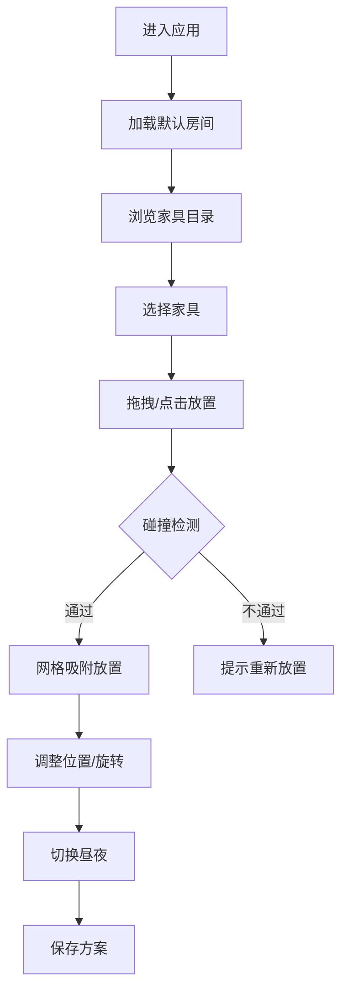

## 1. 产品概述

「宠物小窝 3D」是一款 Web 端 3D 房间布置应用，用户可在圆角可爱的 3D 小屋内为圆嘟嘟宠物摆放家具、玩具与睡垫，打造专属宠物空间，并可切换昼夜光照氛围。

- 核心价值：提供沉浸式 3D 宠物房间装扮体验，满足用户对虚拟宠物养育的情感需求
- 目标用户：喜爱宠物、享受装饰布置类游戏的年轻用户群体

## 2. 核心功能

### 2.1 功能模块
1. **3D 房间视口**：轨道相机控制、家具选中与编辑（移动/旋转/删除）
2. **家具 Catalog**：分类浏览 15+ 可放置物品，拖拽或点击放置
3. **布局网格辅助**：地面网格显示、碰撞检测、吸附对齐
4. **昼夜切换**：白天/夜晚光照氛围切换，星星灯自动点亮
5. **布置方案管理**：本地保存/加载 3 个方案槽位，支持 JSON 导入导出

### 2.2 页面详情
| 页面名称 | 模块名称 | 功能描述 |
|-----------|-------------|---------------------|
| 主页面 | 3D 视口 | 显示 3D 房间场景，支持相机控制、家具选中与 gizmo 操作 |
| 主页面 | 家具目录 | 分类 Tab（睡眠/饮食/玩耍/装饰），展示可放置物品缩略图 |
| 主页面 | 工具栏 | 网格开关、昼夜切换、撤销操作、方案管理按钮 |
| 主页面 | 宠物角色 | 圆嘟嘟宠物模型自动漫游，与家具互动 |

## 3. 核心流程

用户进入应用 → 查看默认 3D 房间场景 → 从家具目录选择物品 → 拖拽或点击放置到地面 → 调整位置/旋转 → 切换昼夜氛围 → 保存布置方案

## 4. 用户界面设计

### 4.1 设计风格
- **主色调**：pastel 马卡龙色系，粉蓝、奶黄、浅紫为主
- **按钮风格**：圆角胶囊形按钮，带轻微阴影与悬浮动效
- **字体**：圆润可爱的中文字体，标题使用手写风格装饰字体
- **布局**：左侧家具目录面板，右侧 3D 视口，顶部工具栏
- **视觉元素**：圆角卡片、柔和阴影、渐变背景、可爱图标

### 4.2 3D 场景设计
- **环境**：单室圆角盒子结构，pastel 配色墙面与地面，预置门、窗、地毯
- **光照**：白天使用 HemisphereLight + DirectionalLight 暖白光；夜间使用暖色点光源模拟台灯，窗户星空 emissive 效果
- **相机**：轨道相机，默认 45° 俯视角，支持缩放和平移
- **物体风格**：圆嘟嘟低多边形风格，所有家具边角圆润处理
- **动画**：家具放置动画、昼夜切换 2 秒过渡、宠物漫游与互动动画

### 4.3 页面设计概述
| 页面名称 | 模块名称 | UI 元素 |
|-----------|-------------|-------------|
| 主页面 | 家具目录 | 分类 Tab 切换、物品卡片网格、拖拽提示 |
| 主页面 | 3D 视口 | TransformControls gizmo、选中高亮、网格线 |
| 主页面 | 工具栏 | 圆角图标按钮、状态指示、下拉菜单 |
| 主页面 | 方案管理 | 模态弹窗、槽位卡片、命名输入框 |

### 4.4 响应式
- 桌面端：左侧目录 + 右侧视口的双栏布局
- 移动端：底部抽屉式家具目录，简化 gizmo 为大按钮操作，优化触摸交互
