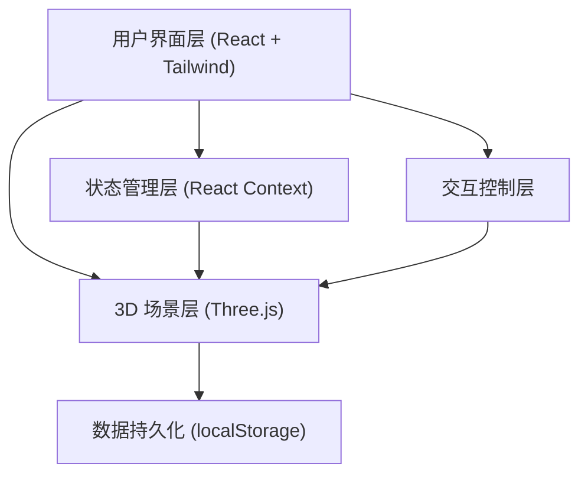

## 1. 架构设计



## 2. 技术描述

### 2.1 前端技术栈
- **框架**: React 18 + TypeScript
- **构建工具**: Vite 5
- **样式**: Tailwind CSS 3
- **3D 引擎**: Three.js r160
- **3D 辅助**: @react-three/fiber, @react-three/drei
- **状态管理**: React Context + useReducer

### 2.2 核心模块说明
| 模块 | 技术实现 | 说明 |
|------|----------|------|
| 3D 视口 | Three.js + OrbitControls + TransformControls | 射线拾取、相机控制、家具变换操作 |
| 房间构建 | Three.js RoundedBoxGeometry + CSG | 圆角盒子房间、门窗地毯占位 |
| 家具系统 | Three.js InstancedMesh / Group | 15+ 家具模型，instanceId 唯一标识 |
| 碰撞检测 | AABB 包围盒算法 | 家具放置时的重叠检测 |
| 网格吸附 | 数学计算对齐 0.5m 网格 | 物品底面中心对齐网格点 |
| 动画系统 | Three.js AnimationMixer + GSAP | 宠物漫游、昼夜过渡、放置动画 |
| 光照系统 | HemisphereLight + PointLight + SpotLight | 昼夜光照切换，2 秒平滑过渡 |

## 3. 目录结构

```
src/
├── components/
│   ├── FurnitureCatalog/    # 家具目录组件
│   ├── Toolbar/             # 工具栏组件
│   ├── SceneViewport/       # 3D 视口组件
│   ├── SchemeModal/         # 方案管理弹窗
│   └── GizmoControls/       # 移动端 gizmo 按钮
├── scene/
│   ├── Room.ts              # 房间构建
│   ├── Furniture.ts         # 家具模型工厂
│   ├── Pet.ts               # 宠物模型与动画
│   ├── Lighting.ts          # 光照系统
│   └── helpers/
│       ├── GridHelper.ts    # 网格辅助
│       └── CollisionDetector.ts  # 碰撞检测
├── store/
│   ├── SceneContext.tsx     # 场景状态管理
│   └── types.ts             # 类型定义
├── utils/
│   ├── storage.ts           # localStorage 操作
│   ├── instanceId.ts        # 唯一 ID 生成
│   └── snap.ts              # 网格吸附计算
└── data/
    └── furniture.ts         # 家具配置数据
```

## 4. 数据模型

### 4.1 家具实例数据结构
```typescript
interface FurnitureInstance {
  instanceId: string;
  furnitureId: string;
  position: { x: number; y: number; z: number };
  rotation: { x: number; y: number; z: number };
  scale: { x: number; y: number; z: number };
}
```

### 4.2 布置方案数据结构
```typescript
interface Scheme {
  id: string;
  name: string;
  createdAt: number;
  updatedAt: number;
  furniture: FurnitureInstance[];
  dayTime: 'day' | 'night';
}
```

### 4.3 操作历史记录
```typescript
interface HistoryState {
  past: FurnitureInstance[][];
  present: FurnitureInstance[];
  future: FurnitureInstance[][];
}
```

## 5. 核心交互流程

### 5.1 家具放置流程
1. 用户从目录拖拽/点击家具
2. 射线检测获取地面交点
3. 网格吸附计算对齐位置
4. AABB 碰撞检测
5. 无碰撞则创建实例并添加到场景
6. 记录操作历史

### 5.2 昼夜切换流程
1. 点击切换按钮
2. 检测宠物是否在床上
3. 触发对应动画（打哈欠）
4. 2 秒平滑过渡光照参数
5. 夜间自动点亮星星灯 emissive
6. 更新场景状态

## 6. 性能优化

- 使用 InstancedMesh 渲染重复家具
- 碰撞检测空间分区优化
- 动画帧节流
- 合理设置像素比和阴影分辨率
